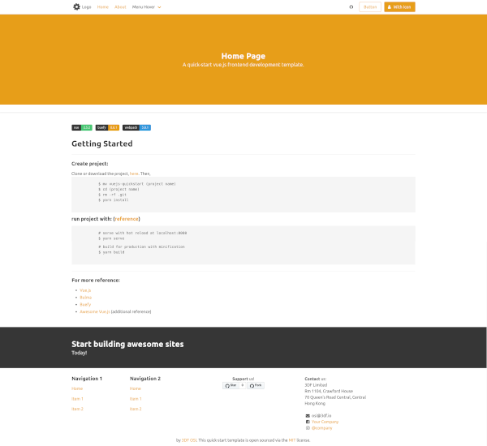

# vuejs-quickstart
maintained by: `hkdb@3df.io`

<font size="16"> +  + </font>

## SUMMARY:
Quickstart template for Vue.JS Websites built with vue-cli and modified code of [ndro/vue-webpack-buefy](https://github.com/ndro/vue-webpack-buefy).

## SCREENSHOT:



## PROJECT SETUP:
```
yarn install
```

### Compiles and hot-reloads for development
```
yarn serve
```

### Compiles and minifies for production
```
yarn build
```

### Run your unit tests
```
yarn test:unit
```

### Lints and fixes files
```
yarn lint
```

### Customize configuration
See [Configuration Reference](https://cli.vuejs.org/config/).

## CHANGE LOG

- August 24, 2020 - Initial commit

## HOW IT WAS CREATED:
1. Used vue-cli to create project:

    ```
    vue create vuejs-quickstart

    Vue CLI v4.5.4
    ? Please pick a preset: Manually select features
    ? Check the features needed for your project: 
    ◉ Choose Vue version
    ◉ Babel
    ◯ TypeScript
    ◯ Progressive Web App (PWA) Support
    ◉ Router
    ◯ Vuex
    ◉ CSS Pre-processors
    ◉ Linter / Formatter
    ❯◉ Unit Testing
    ◯ E2E Testing

    Vue CLI v4.5.4
    ? Please pick a preset: Manually select features
    ? Check the features needed for your project: Choose Vue version, Babel, Router,
    CSS Pre-processors, Linter, Unit
    ? Choose a version of Vue.js that you want to start the project with (Use arrow 
    keys)
    ❯ 2.x 
    3.x (Preview)

    Vue CLI v4.5.4
    ? Please pick a preset: Manually select features
    ? Check the features needed for your project: Choose Vue version, Babel, Router,
    CSS Pre-processors, Linter, Unit
    ? Choose a version of Vue.js that you want to start the project with 2.x
    ? Use history mode for router? (Requires proper server setup for index fallback 
    in production) (Y/n) Y

    Vue CLI v4.5.4
    ? Please pick a preset: Manually select features
    ? Check the features needed for your project: Choose Vue version, Babel, Router,
    CSS Pre-processors, Linter, Unit
    ? Choose a version of Vue.js that you want to start the project with 2.x
    ? Use history mode for router? (Requires proper server setup for index fallback 
    in production) Yes
    ? Pick a CSS pre-processor (PostCSS, Autoprefixer and CSS Modules are supported 
    by default): 
    Sass/SCSS (with dart-sass) 
    ❯ Sass/SCSS (with node-sass) 
    Less 
    Stylus

    Vue CLI v4.5.4
    ? Please pick a preset: Manually select features
    ? Check the features needed for your project: Choose Vue version, Babel, Router,
    CSS Pre-processors, Linter, Unit
    ? Choose a version of Vue.js that you want to start the project with 2.x
    ? Use history mode for router? (Requires proper server setup for index fallback 
    in production) Yes
    ? Pick a CSS pre-processor (PostCSS, Autoprefixer and CSS Modules are supported 
    by default): Sass/SCSS (with node-sass)
    ? Pick a linter / formatter config: (Use arrow keys)
    ❯ ESLint with error prevention only 
    ESLint + Airbnb config 
    ESLint + Standard config 
    ESLint + Prettier

    Vue CLI v4.5.4
    ? Please pick a preset: Manually select features
    ? Check the features needed for your project: Choose Vue version, Babel, Router,
    CSS Pre-processors, Linter, Unit
    ? Choose a version of Vue.js that you want to start the project with 2.x
    ? Use history mode for router? (Requires proper server setup for index fallback 
    in production) Yes
    ? Pick a CSS pre-processor (PostCSS, Autoprefixer and CSS Modules are supported 
    by default): Sass/SCSS (with node-sass)
    ? Pick a linter / formatter config: Basic
    ? Pick additional lint features: 
    ◯ Lint on save
    ❯◉ Lint and fix on commit

    Vue CLI v4.5.4
    ? Please pick a preset: Manually select features
    ? Check the features needed for your project: Choose Vue version, Babel, Router,
    CSS Pre-processors, Linter, Unit
    ? Choose a version of Vue.js that you want to start the project with 2.x
    ? Use history mode for router? (Requires proper server setup for index fallback 
    in production) Yes
    ? Pick a CSS pre-processor (PostCSS, Autoprefixer and CSS Modules are supported 
    by default): Sass/SCSS (with node-sass)
    ? Pick a linter / formatter config: Basic
    ? Pick additional lint features: Lint and fix on commit
    ? Pick a unit testing solution: 
    Mocha + Chai 
    ❯ Jest

    Vue CLI v4.5.4
    ? Please pick a preset: Manually select features
    ? Check the features needed for your project: Choose Vue version, Babel, Router,
    CSS Pre-processors, Linter, Unit
    ? Choose a version of Vue.js that you want to start the project with 2.x
    ? Use history mode for router? (Requires proper server setup for index fallback 
    in production) Yes
    ? Pick a CSS pre-processor (PostCSS, Autoprefixer and CSS Modules are supported 
    by default): Sass/SCSS (with node-sass)
    ? Pick a linter / formatter config: Basic
    ? Pick additional lint features: Lint and fix on commit
    ? Pick a unit testing solution: Jest
    ? Where do you prefer placing config for Babel, ESLint, etc.? 
    In dedicated config files 
    ❯ In package.json

    Vue CLI v4.5.4
    ? Please pick a preset: Manually select features
    ? Check the features needed for your project: Choose Vue version, Babel, Router,
    CSS Pre-processors, Linter, Unit
    ? Choose a version of Vue.js that you want to start the project with 2.x
    ? Use history mode for router? (Requires proper server setup for index fallback 
    in production) Yes
    ? Pick a CSS pre-processor (PostCSS, Autoprefixer and CSS Modules are supported 
    by default): Sass/SCSS (with node-sass)
    ? Pick a linter / formatter config: Basic
    ? Pick additional lint features: Lint and fix on commit
    ? Pick a unit testing solution: Jest
    ? Where do you prefer placing config for Babel, ESLint, etc.? In package.json
    ? Save this as a preset for future projects? (y/N) N
    ```
2. Pulled in an edited version of [ndro/vue-webpack-buefy](https://github.com/ndro/vue-webpack-buefy)'s src/
